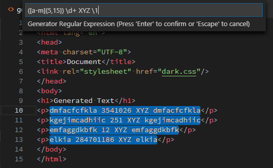

# Regex Text Generator

Generate text based on Regular Expression (regex) with live preview.



Usually regular expressions are used to find text that has a certain format. But they can also be used to generate text that has a certain format. And the generated text would be matched by the same regular expression, with no or minor changes if it uses the special references `{{ }}`.

The current selection is replaced with the generated text.

The command supports Multi Cursor. Each selected range has it own version of the generated text. A selection can be empty, just a cursor.

In the Command Palette use the command: `Generate text based on Regular Expression (regex)`

In key bindings use the command: `regexTextGen.generateText`

## Character Sets

The generated text uses a character set to pick characters for the non-literal constructs: `.`, `\w`, `\s`, `\d`, `\W`, `\S`, `\D`.

We have a base character set, with all the characters allowed, and 3 sub groups for the whitespace (`\s`), word character (`\w`), and digits (`\d`).

The character set used for `\W`, `\S`, `\D` is constructed by taking the difference of base character set and the sub group character set (`\w`, `\s`, `\d`).

A character set is specified as an array of strings. A string can be a single unicode point (character) or a range of unicode points (string is 3 characters long). A unicode point can be specified as the UTF-8 representation or the unicode escape `\u`_`hhhh`_.

The default base character set is specified with: `["\u0009", "\u0020-\u007e"]`

This is the UTF-8 Horizontal Tab and the Base Latin characters.

Replacing the `a-z` and `A-Z` with the greek characters would look like: `["\u0009", "\u0020-@", "[-\u0060", "{-~", "\u0391-Ω", "α-ω"]`

The characters that are not part of the base character set are removed from the character range.

## Settings and arguments

The settings that can be specified in `settings.json` file or the arguments for key binding are:

* `originalTextRegex` : a string. Start of the input box: Match Original Text Regex. default: `.*`
* `generatorRegex` : a string. Start of the input box: Generator Regex. default: `(a|b|c){5,}`
* `defaultUpperLimit` : an integer. An upper limit for the repeat quantifiers that have no upper limit: `*`, `+`, <code>{<em>n</em>,}</code>. default: 10
* `baseCharSet` : array of strings. Character set `.` will generate from. default: `["\u0009", "\u0020-\u007e"]`
* `whitespaceCharSet` : array of strings. Character set `\s` will generate from. default: `["\u0009", "\u0020"]`
* `digitCharSet` : array of strings. Character set `\d` will generate from. default: `["0-9"]`
* `wordCharSet` : array of strings. Character set `\w` will generate from. default: `["_", "0-9", "a-z", "A-Z"]`

For the `args` property of the keybinding also:

* `useInputBox` : (boolean) use the input boxes to modify the regular expressions. default: `false`

For a [key bindings in `keybindings.json`](https://code.visualstudio.com/docs/getstarted/keybindings) the `args` property is an object with the given properties.

The property `useInputBox` allows to define different start regular expressions or different character sets.

An example: we use the `whitespaceCharSet` and `digitCharSet` from the `settings.json` file.

```json
  {
    "key": "ctrl+shift+f9",
    "when": "editorTextFocus",
    "command": "regexTextGen.generateText",
    "args": {
      "generatorRegex" : "(\\w{5,}) \\d{1,4} XY\\1",
      "defaultUpperLimit" : 15,
      "baseCharSet" : ["\u0009", "\u0020-\u007e", "α-ω"],
      "wordCharSet" : ["α-ω"]
    }
  }
```

## Flags of the Original Text Regular Expression

It is possible to set the following flags on the `originalTextRegex` property:

* `i` : ignore case
* `g` : global search
* `m` : multi-line search

You specify the flags at the start of the string with: <code>(?<em>flags</em>)</code>

Instead of _flags_ you write any combination of the 3 flags.

Example: `(?ig)[A-Z]+-\d+`

If you add the `g` flag (global) the result of the match on the original text will be different. Read the documentation of [`String.match()`](https://developer.mozilla.org/en-US/docs/Web/JavaScript/Reference/Global_Objects/String/match#Return_value) at MDN. See also [Original text back reference](#original-text-back-reference).

## Generator Regex syntax

The following regex symbols are recognised in the `generatorRegex` regular expression.

<table>
<tr><th>Symbol</th><th>Description</th><th>Example</th></tr>
<tr><td><code>.</code></td><td>any single character</td><td><code>a.b.c</code></td></tr>
<tr><td><code>[ ]</code></td><td>inclusive character range</td><td><code>[A-C][a-c1-5_$]{,7}</code></td></tr>
<tr><td><code>[^ ]</code></td><td>exclusive character range</td><td><code>[A-C][^a-c1-5_$]{,7}</code></td></tr>
<tr><td><code>|</code></td><td>alternatives</td><td><code>car|train|bike</code></td></tr>
<tr><td><code>*</code></td><td>zero or more repeats</td><td><code>abc*</code></td></tr>
<tr><td><code>+</code></td><td>one or more repeats</td><td><code>abc+</code></td></tr>
<tr><td><code>?</code></td><td>zero or one repeats</td><td><code>abc?</code></td></tr>
<tr><td><code>{<em>expr</em>}</code></td><td>exact number of repeats</td><td><code>(a|b|c){5}</code></td></tr>
<tr><td><code>{<em>expr</em>,<em>expr</em>}</code></td><td>range of repeats</td><td><code>(a|b|c){1,7}</code></td></tr>
<tr><td><code>{<em>expr</em>,}</code></td><td>lower bounded number of repeats</td><td><code>(a|b|c){3,}</code></td></tr>
<tr><td><code>(<em>r</em>)</code></td><td>capture group</td><td><code>(abc*)</code></td></tr>
<tr><td><code>\<em>n</em></code></td><td>capture group backreference</td><td><code>(abc*)XYZ\1</code></td></tr>
<tr><td><code></code></td><td>original text (capturing group) backreference.</td><td><code>XY-{{1}}-AP</code></td></tr>
<tr><td><code></code></td><td><a hrfa="#modified-original-text-backreference">modified original text (capturing group) backreference</a>.</td><td><code>{{1:first}}///{{1:-first}}</code></td></tr>
<tr><td><code>{{=<em>expr</em>}}</code></td><td>numeric value expression.</td><td><code>{{=i+1}}: XY</code></td></tr>
<tr><td><code>\s</code> and <code>\S</code></td><td>whitespace / non-whitespace alias</td><td></td></tr>
<tr><td><code>\d</code> and <code>\D</code></td><td>digit / non-digit alias</td><td></td></tr>
<tr><td><code>\w</code> and <code>\W</code></td><td>word / non-word alias</td><td></td></tr>
<tr><td><code>\*</code>, ...</td><td>Escape meta character</td><td><code>\*\.\+\?\[\]\{\}\(\)\^\$\|\\</code></td></tr>
</table>

Any other characters are taken literal.

Inside json files you can use the unicode point escape to specify a literal character: <code>\u<em>hhhh</em></code>

### Character range

A character range `[]` can contain one or more: literal characters or a range of characters `A-P`

The only meta character that needs to be escaped inside a character range `[]` is the `]`. Other escapes, like `\*`, are not recognised.

If you want to have a `-` as part of a character range `[]`, start the range with a `-`: `[-0-9]` are all the digits plus the `-` character

### Expressions

The expressions allowed are numeric calculations. Because of Javascript some that use the variable `j` have a string result.

An expression can be used to:

* determine the value(s) of a repeat, e.q. <code>{<em>expr</em>,<em>expr</em>}</code>
* get the capture group or match of the `originalTextRegex` applied to the selected text of the range, <code></code>
* output a numeric value, <code>{{=<em>expr</em>}}</code>

The following characters and variables are allowed:

* `0..9` : to construct integer numbers
* `+-*/%()` : mathematical operators and grouping
* `i` : the 0-based index of the current range/selection
* `j[]` : `j` is an array with the repeat counter values (0-based). `j[0]` is the repeat counter value of the repeat closest to the right of the expression. `j[1]` is the next closest to the right. This makes it possible to copy/paste parts of a Generator Expression and not worry about which repeat it is. Most likely you want the closest repeat.<br/>Because the expressions are evaluated by a JavaScript engine the variable `j` can be used without square brackets. Depending on the content of `j` the result will be converted to:
    * `[]` : the empty array is converted to `""` (empty string). Depending on the operator used it can be converted to `0` (numeric zero)
    * <code>[<em>n</em>, ...]</code> : it has 1 or more values is converted to a string with the values separated by `,`. If it contains only 1 value depending on the operator it can be converted to the numeric value. The array `[5,2,3]` is converted to the string: `5,2,3`
* `S` : is the number of elements in the result of matching the `originalTextRegex` to the content of the selection. See also [Original text back reference](#original-text-backreference). This makes it possible to loop over all matched parts if you have specified the `g` flag. For example to show all matched parts with a `-` as separator and numbered starting at 1:<br/>`({{=j[0]+1}}:{{j[0]}}-){S}`
* `N[]` : `N` is an array of numbers. Every element of the result of matching the `originalTextRegex` to the content of the selection is converted to a number with the JavaScript function [`Number()`](https://developer.mozilla.org/en-US/docs/Web/JavaScript/Reference/Global_Objects/Number). If a captured group can't be converted to a number that element in the array will be `0`.

### Original text backreference

The originaly selected text in the range is matched against a regular expression with [`String.match()`](https://developer.mozilla.org/en-US/docs/Web/JavaScript/Reference/Global_Objects/String/match#Return_value). This regular expression can use the full Javascript syntax.

The content of the original text backreference <code></code> depends on the setting of the `g` flag on the `originalTextRegex`.

#### Without `g` flag

The captured groups of the first match can be used in the generated text with special back references.

Back reference `{{0}}` is all the matched text, this is not always the original text of the selected range. Add `.*` before and after the regex if needed.

`{{1}}` ... are the text matched by the specific capture groups of `originalTextRegex`.

There is no limit to the number of capture groups you can define in `originalTextRegex`.

By using the variable `S` in a repeat specification, `{S-1}`, you can loop over all the captured groups: `{{j[0]+1}}{S-1}`

#### With `g` flag

Any of the matches of the regular expression in the original text can be used in the generated text with special back references: <code></code> . By using the variable `S` in a repeat specification, `{S}`, you can loop over all the matches.

### Modified original text backreference

An original backreference can be modified  with the following modifiers: <code></code>

* `:first` : Instead of taking the captured group of the current source range, take the corresponding captured group of the **first** source range. 
* `:-first` : If the captured group of the current source range starts with the corresponding captured group of the **first** source range, only use what is additional to the captured group of the current source range.

For example if you want to add indented comments to a number of lines, and use the first line indentation to place the comment you can use the following keybinding:

```
  {
    "key": "ctrl+shift+f7",  // or any other key combination
    "when": "editorTextFocus",
    "command": "regexTextGen.generateText",
    "args": {
      "originalTextRegex": "([ \\t]*)(.*)",
      "generatorRegex" : "{{1:first}}/// {{1:-first}}{{2}}",
      "useInputBox" : false
    }
  }
```

`///` is the comment (doxygen) characters we want to add to the beginning of the lines. Empty lines will be handled correctly, because both capture groups are empty.

If you want to use the keybinging as a template and make changes you can set `useInputBox` to `true` or delete that line.

### Two step Find and Replace

If you perform a search based on a regular expression in the Find dialog of VSC and you select 1 or multiple instances you can split these selected ranges with the regular expression `originalTextRegex` and use the captured groups in the replacement string (the generated text). If you don't use the meta characters in the `generatorRegex` you can see this as a two step Find and Replace.

## Known problems

* if the initial generator regular expression (when the input box shows) has an error the preview does not show a change and you don't see the error message. Currently VSC (v1.44.2) shows the prompt `Generator Regular Expression` instead of the error message. To see the error message type a character at the end and remove the character. The [filed issue](https://github.com/microsoft/vscode/issues/97913) for this problem.

## Credits

I have used parts of the following programs:

* Gus Hurovich for developing the [live preview for: `Emmet: Wrap with abbreviation`](https://github.com/microsoft/vscode/pull/45092)
* Yukai Huang for extracting the preview code to use in an extension: [`map-replace.js`](https://github.com/Yukaii/map-replace.js)
* Rob Dawson for: [JavaScript Regular Expression Parser](http://codebox.org.uk/pages/regex-parser)

## TODO

* non-capturing groups `(?:)` in the Generator Regex because the number of back references is limited to 9
* a command-variable command where the source is also one of the arguments
* allow `\w`, `\s`, `\d`, `\W`, `\S`, `\D` inside character ranges `[]`
* live preview of the captured groups while entering the `originalTextRegex`
* reference named groups in the `originalTextRegex`
* specify an optional rounding of the Expression, in case the input is a float or we use `/`
